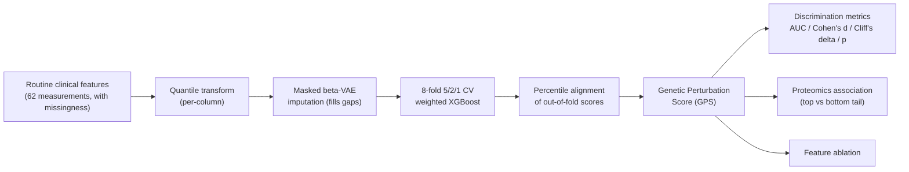

# PerturbomeAI

**Decoding locus-specific genetic perturbations from routine clinical phenotypes.**

PerturbomeAI is a phenotype-to-perturbation framework. For a genetic locus, it
learns the multivariate signature that the locus's perturbation leaves on
routine clinical measurements, and converts it into an individual-level
**Genetic Perturbation Score (GPS)** - a continuous, calibrated readout of how
strongly each person's physiology resembles a carrier's. The score is then used
for downstream biology, including score-driven proteomic association.

This repository is fully self-contained: a synthetic biobank generator lets the
entire pipeline run end-to-end **without any private data**, while every stage
can be pointed at real biobank tables through a single config file.

## Method at a glance



- **Imputation:** a masked beta-VAE reconstructs missing measurements so each
  individual enters scoring with a complete feature vector.
- **Scoring:** XGBoost with a weighted positive/negative loss
  (`scale_pos_weight = n_neg/n_pos`), trained under an **8-fold cross-validation
  with a 5 train / 2 validation (early stopping) / 1 test** rotation, so every
  individual receives one out-of-fold score.
- **Alignment:** out-of-fold scores are mapped by empirical mid-rank percentile
  to a reference fold's distribution.
- **Evaluation:** AUC, Cohen's d, Cliff's delta and the two-sided Mann-Whitney
  p-value.
- **Downstream:** score-driven differential proteomics (OLS adjusting for
  age/sex, BH-FDR, volcano plot) and feature ablation.

## Repository layout

```
perturbomeai/        # the core library (one module per pipeline stage)
scripts/             # config-driven CLIs + the end-to-end demo
configs/pipeline.yaml# the single source of truth for data paths + hyperparameters
simulation/          # controlled synthetic testbed validating the premise
hpc/                 # genome-scale 8-fold -> 8-GPU wave-pool chapter
docs/                # usage.md (per-stage) + methods.md (paper Methods)
examples/            # demo outputs land here
```

## Install

Python 3.8+ is required.

```bash
git clone <this-repo> && cd p2g-github
python -m venv .venv && source .venv/bin/activate
pip install -r requirements.txt
# optional: install as a package
pip install -e .
```

## 60-second demo (no data needed)

```bash
python scripts/run_demo.py
```

This synthesises a biobank, imputes missing features with the VAE, scores
several loci with the 8-fold weighted XGBoost, aligns the scores, computes the
four discrimination metrics, runs score-driven proteomics on the coupled locus,
and runs a feature ablation. Outputs are written to `examples/demo_output/`:

- `locus_metrics.csv`, `locus_fold_metrics.csv` - per-locus and per-fold metrics
- `score_<locus>.csv` - aligned GPS per individual
- `proteomics_<locus>.csv`, `proteomics_volcano_<locus>.png`
- `ablation_<locus>.csv`
- `summary.json`

## Run a single stage

Each stage is a small, config-driven CLI (see `docs/usage.md`):

```bash
python scripts/impute.py                       # quantile transform + VAE imputation
python scripts/score.py   --locus locus_01     # 8-fold weighted XGBoost + align + metrics
python scripts/proteomics.py --score examples/demo_output/score_locus_01.csv
python scripts/ablation.py --locus locus_01    # Top-K feature ablation
```

## Use your own (real) data

Edit `configs/pipeline.yaml`, set `data.mode: files`, and point to your tables:

```yaml
data:
  mode: files
  files:
    feature_table: /path/to/features.csv     # pid + the 62 INPUT_FEATURES columns
    label_table:   /path/to/labels.parquet   # pid + one binary column per locus
    proteomics_table: /path/to/proteomics.parquet  # pid, age, [gender], protein_* columns
    loci: [locus_a, locus_b]                  # empty -> all label columns
```

Data locations are read only from this config file. The expected feature
columns are listed in `perturbomeai/features.py`.

## The two extra chapters

- **`simulation/`** - a controlled forward generative model (natural
  negative-selection prior) with known ground truth, used to show how
  recoverability depends on allele frequency and effect size. See
  `simulation/README.md`.
- **`hpc/`** - the genome-scale parallel-computing chapter: 8 folds map onto 8
  GPUs, a shared feature memmap is read once, and an overlapping wave-pool
  pipeline develops + cross-scores hundreds of thousands of loci in ~2 days. It
  includes a CPU demo and a measured throughput projection. See `hpc/README.md`.

## Documentation

- `docs/usage.md` - per-stage usage and the config schema.
- `docs/methods.md` - the methodology in paper-Methods form.

## License

MIT - see [LICENSE](LICENSE).

## Citation

```bibtex
@software{perturbomeai,
  title  = {PerturbomeAI: decoding locus-specific genetic perturbations from routine clinical phenotypes},
  author = {PerturbomeAI authors},
  year   = {2026},
  note   = {https://github.com/<org>/perturbomeai}
}
```
